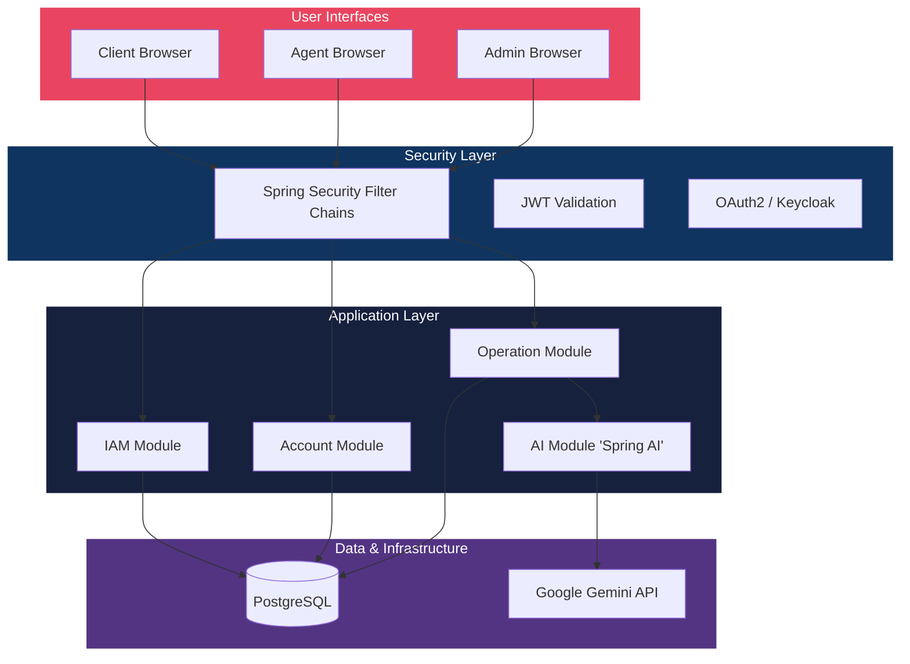
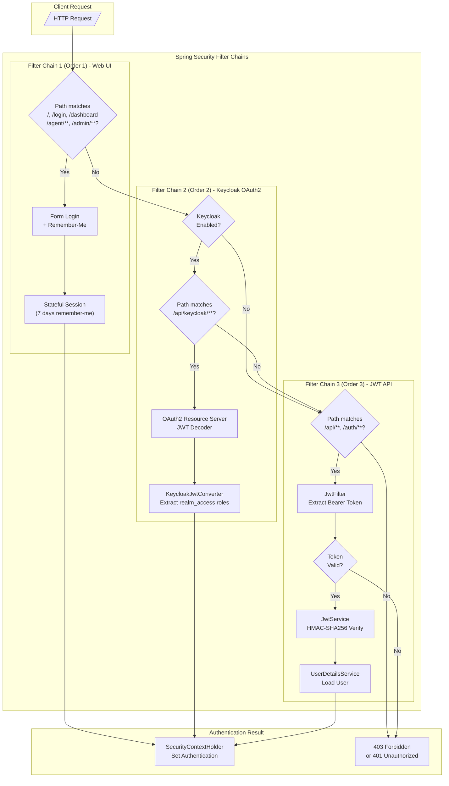
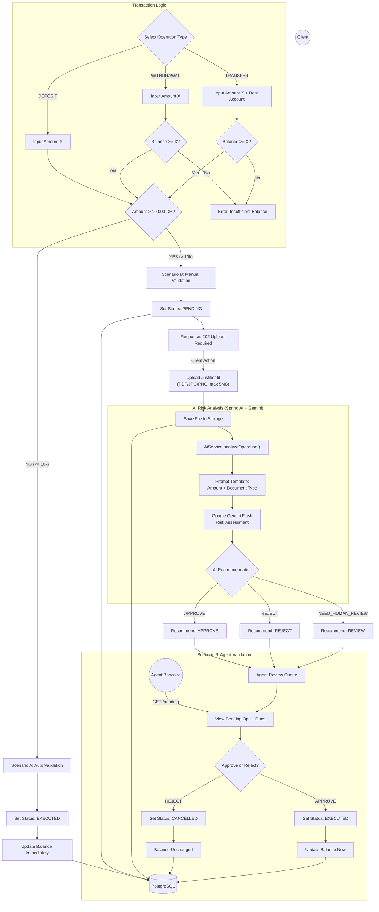
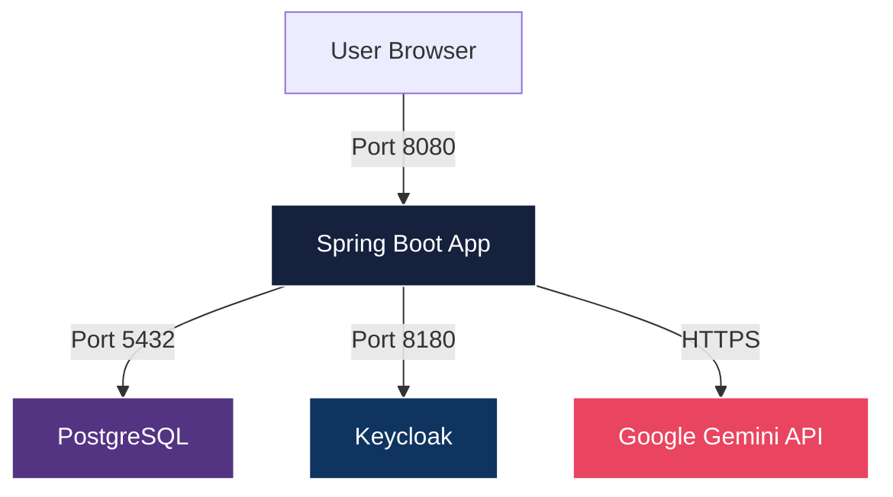

# Al Baraka Digital Banking Platform

[](https://openjdk.org/projects/jdk/17/)
[](https://spring.io/projects/spring-boot)
[](https://angular.dev/)
[](https://spring.io/projects/spring-ai)

Secure banking platform with **dual JWT/OAuth2 authentication**, **AI-powered risk analysis**, **Angular 19 frontend**, role-based access control, and automated transaction workflows.

---

## Table of Contents

- [Features](#features)
- [Architecture Overview](#architecture-overview)
- [Frontend (Angular 19)](#frontend-angular-19)
- [Authentication & Security](#authentication--security)
- [Business Logic](#business-logic)
- [Spring AI Integration](#spring-ai-integration)
- [REST API Documentation](#rest-api-documentation)
- [Docker & Deployment](#docker--deployment)
- [Project Structure](#project-structure)
- [Development](#development)

---

## Features

**Backend:**
- Dual Authentication: JWT stateless tokens + OAuth2/Keycloak
- Role-based Access Control: CLIENT, AGENT_BANCAIRE, ADMIN
- AI-Powered Risk Analysis: Automated transaction validation using Spring AI + Google Gemini
- Automated Workflows: 10,000 DH threshold for auto-approval
- Banking Operations: Deposit, Withdrawal, Transfer
- Document Upload: Justification for high-value transactions
- Web Interface: Thymeleaf-based dashboard (legacy)
- Docker Ready: Multi-service deployment with Docker Compose

**Frontend (V3):**
- Angular 19 with standalone components
- Server-Side Rendering (SSR) support
- TailwindCSS styling
- Role-based dashboards (Client, Agent, Admin)
- Document viewer with PDF/image preview
- AI analysis display for agents
- JWT authentication with interceptors

---

## Architecture Overview



---

## Frontend (Angular 19)

The platform includes a modern Angular 19 SPA with role-based dashboards.

### Tech Stack

| Technology | Purpose |
|------------|---------|
| Angular 19 | Frontend framework (standalone components) |
| TailwindCSS | Utility-first CSS styling |
| RxJS | Reactive state management |
| SSR | Server-Side Rendering support |

### Project Structure

```
frontend/
├── src/app/
│   ├── core/
│   │   ├── guards/         # Auth & role guards
│   │   ├── interceptors/   # JWT & error interceptors
│   │   ├── models/         # TypeScript interfaces
│   │   └── services/       # Auth, operations, user services
│   └── features/
│       ├── auth/           # Login, register, unauthorized
│       ├── client/         # Client dashboard
│       ├── agent/          # Agent dashboard with review
│       └── admin/          # Admin user management
```

### Running the Frontend

```bash
cd frontend
npm install
npm start
# Available at http://localhost:4200
```

### Key Features

**Client Dashboard:**
- Account balance overview
- Create operations (deposit, withdrawal, transfer)
- Document upload for high-value transactions
- Operation history with status tracking

**Agent Dashboard:**
- Pending operations queue
- Document viewer (PDF/image preview)
- AI analysis recommendations display
- Approve/reject workflow

**Admin Dashboard:**
- User management (CRUD)
- Role assignment
- User statistics

---

## Authentication & Security

### JWT Stateless Authentication

The platform implements **stateless JWT authentication** for REST API endpoints.



**Key Configuration:**
| Parameter | Value | Description |
|-----------|-------|-------------|
| Algorithm | HS256 | HMAC-SHA256 signing |
| Expiration | 24 hours | Token validity |
| Password Encoding | BCrypt | Industry-standard hashing |

**JWT Flow:**
1. Client sends credentials to `/auth/login`
2. Server validates and returns signed JWT
3. Client includes token in `Authorization: Bearer <token>` header
4. `JwtFilter` validates token on each request
5. User context set in `SecurityContextHolder`

### OAuth2/Keycloak Integration

For enterprise deployments, the platform supports **Keycloak as an OAuth2 Resource Server**.

```yaml
# application.yaml
keycloak:
  enabled: ${KEYCLOAK_ENABLED:false}

spring:
  security:
    oauth2:
      resourceserver:
        jwt:
          issuer-uri: ${KEYCLOAK_ISSUER_URI:http://localhost:8180/realms/albaraka}
```

**Keycloak Realm Configuration:**
- Realm: `albaraka`
- Roles: `client`, `agent`, `admin`
- Client: `albaraka-bank-api` (public client, Direct Grant enabled)
- Token Lifespan: 24 hours

### Security Filter Chains

The application uses **three ordered security filter chains**:

| Order | Matcher | Authentication | Session |
|-------|---------|----------------|---------|
| 1 | `/`, `/login`, `/dashboard`, `/agent/**`, `/admin/**` | Form Login + Remember-Me | Stateful |
| 2 | `/api/keycloak/**` | OAuth2 Resource Server | Stateless |
| 3 | `/api/**`, `/auth/**` | JWT Bearer Token | Stateless |

```java
// SecurityConfig.java - Three filter chains
@Order(1) webSecurityFilterChain     // Web UI with form login
@Order(2) keycloakSecurityFilterChain // OAuth2 for Keycloak tokens
@Order(3) apiSecurityFilterChain      // JWT for REST API
```

---

## Business Logic

### Banking Operations

| Operation | Description | Balance Effect |
|-----------|-------------|----------------|
| `DEPOSIT` | Credit funds to account | +Amount |
| `WITHDRAWAL` | Debit funds from account | -Amount |
| `TRANSFER` | Move funds between accounts | Source: -Amount, Dest: +Amount |

### Automatic vs Manual Validation



### Strategy Pattern Implementation

Banking operations use the **Strategy Pattern** for clean separation of concerns:

```
OperationFactory
      │
      ├── DepositStrategy.process(amount, source, dest)
      │       └── source.balance += amount
      │
      ├── WithdrawalStrategy.process(amount, source, dest)
      │       └── source.balance -= amount
      │
      └── TransferStrategy.process(amount, source, dest)
              ├── source.balance -= amount
              └── dest.balance += amount
```

---

## Spring AI Integration

The platform uses **Spring AI with Google Gemini** for intelligent transaction risk analysis.

### AI Service Configuration

```yaml
spring:
  ai:
    openai:
      api-key: ${SPRING_AI_GOOGLE_GEMINI_API_KEY}
      base-url: https://generativelanguage.googleapis.com/v1beta/openai/
      chat:
        options:
          model: gemini-3-flash-preview
```

### AI Decision Types

| Decision | Description | Action |
|----------|-------------|--------|
| `APPROVE` | Low-risk transaction | Recommended for approval |
| `REJECT` | Suspicious transaction | Recommended for rejection |
| `NEED_HUMAN_REVIEW` | Uncertain risk | Flagged for review |

### AI Risk Rules

```java
// AiService.java prompt logic
Rules:
1. Verify if document content supports transaction amount.
2. If document mentions amount, it MUST match transaction (5% tolerance).
3. If amount < 50,000 DH and document is 'payslip' or 'invoice' -> APPROVE.
4. If amount >= 50,000 DH -> NEED_HUMAN_REVIEW.
5. If document is 'suspicious' or contradicts -> REJECT.
```

---

## REST API Documentation

### Authentication Endpoints

#### Register (Client)
```http
POST /auth/register
Content-Type: application/json

{
  "fullName": "John Doe",
  "email": "john@example.com",
  "password": "securePassword123"
}
```

**Response:** `200 OK`
```json
{"token": "eyJhbGciOiJIUzI1NiIsInR5cCI6IkpXVCJ9..."}
```

#### Login
```http
POST /auth/login
Content-Type: application/json

{
  "email": "john@example.com",
  "password": "securePassword123"
}
```

### Client Endpoints

> All endpoints require `Authorization: Bearer <token>` with `CLIENT` role.

| Method | Endpoint | Description |
|--------|----------|-------------|
| `POST` | `/api/client/operations` | Create operation |
| `GET` | `/api/client/operations` | List user operations |
| `POST` | `/api/client/operations/{id}/document` | Upload document |

#### Create Operation
```http
POST /api/client/operations
Authorization: Bearer <token>
Content-Type: application/json

{
  "type": "DEPOSIT",
  "amount": 5000
}
```

**Types:** `DEPOSIT`, `WITHDRAWAL`, `TRANSFER`

For transfers:
```json
{
  "type": "TRANSFER",
  "amount": 5000,
  "destinationAccountNumber": "ALB123456789"
}
```

#### Upload Document
```http
POST /api/client/operations/{id}/document
Authorization: Bearer <token>
Content-Type: multipart/form-data

file: <PDF/JPG/PNG, max 5MB>
```

### Agent Endpoints

> Requires `AGENT_BANCAIRE` role.

| Method | Endpoint | Description |
|--------|----------|-------------|
| `GET` | `/api/agent/operations/pending` | List pending operations |
| `PUT` | `/api/agent/operations/{id}/approve` | Approve operation |
| `PUT` | `/api/agent/operations/{id}/reject` | Reject operation |

### Admin Endpoints

> Requires `ADMIN` role.

| Method | Endpoint | Description |
|--------|----------|-------------|
| `GET` | `/api/admin/users` | List all users |
| `POST` | `/api/admin/users` | Create user |
| `PUT` | `/api/admin/users/{id}` | Update user |
| `DELETE` | `/api/admin/users/{id}` | Delete user |

#### Create User
```http
POST /api/admin/users
Authorization: Bearer <token>
Content-Type: application/json

{
  "fullName": "Jane Agent",
  "email": "agent@albaraka.com",
  "password": "password123",
  "role": "AGENT_BANCAIRE",
  "active": true
}
```

**Roles:** `CLIENT`, `AGENT_BANCAIRE`, `ADMIN`

### OAuth2/Keycloak Endpoints

When Keycloak is enabled, parallel endpoints are available:

| Endpoint | Description |
|----------|-------------|
| `/api/keycloak/client/**` | Client operations (Keycloak auth) |
| `/api/keycloak/agent/**` | Agent operations (Keycloak auth) |
| `/api/keycloak/admin/**` | Admin operations (Keycloak auth) |

### Error Responses

| Status | Description |
|--------|-------------|
| `400 Bad Request` | Validation error, insufficient balance |
| `401 Unauthorized` | Invalid/missing token |
| `403 Forbidden` | Insufficient permissions |
| `404 Not Found` | Resource not found |
| `500 Internal Server Error` | Server error |

---

## Docker & Deployment

### Dockerfile (Multi-stage Build)

```dockerfile
# Stage 1: Build
FROM maven:3.9.6-eclipse-temurin-17-alpine AS build
WORKDIR /app
COPY pom.xml .
RUN mvn dependency:go-offline
COPY src ./src
RUN mvn clean package -DskipTests

# Stage 2: Runtime
FROM eclipse-temurin:17-jre-alpine
WORKDIR /app
COPY --from=build /app/target/*.jar /app/app.jar
EXPOSE 8080
ENTRYPOINT ["java", "-jar", "/app/app.jar"]
```

### Docker Architecture


### Docker Compose Services

```yaml
services:
  postgres:      # PostgreSQL 15 database
  keycloak:      # Keycloak 23.0 identity server
  backend:       # Spring Boot application
```

### Quick Start

```bash
# 1. Start backend with Docker
make all   # or: docker-compose up --build

# 2. Start frontend (in separate terminal)
cd frontend
npm install
npm start

# 3. Access
# - Frontend: http://localhost:4200
# - Backend API: http://localhost:8080
# - Keycloak: http://localhost:8180 (if enabled)
```

### Environment Variables

| Variable | Description | Default |
|----------|-------------|---------|
| `POSTGRES_DB` | Database name | - |
| `POSTGRES_USER` | Database user | - |
| `POSTGRES_PASSWORD` | Database password | - |
| `JWT_SECRET` | JWT signing key (Base64) | - |
| `UPLOAD_DIR` | File upload directory | `/app/uploads` |
| `KEYCLOAK_ENABLED` | Enable Keycloak | `false` |
| `KEYCLOAK_ISSUER_URI` | Keycloak realm URL | - |
| `SPRING_AI_OPENAI_API_KEY` | OpenAI API key | - |

---

## CI/CD Pipeline

### GitHub Actions Workflow

```yaml
name: CI/CD Pipeline

on:
  push:
    branches: [main, "feature/**"]
  pull_request:
    branches: [main]

jobs:
  test:
    # Run Maven tests with JDK 17
    
  build-and-push:
    # Build Docker image
    # Push to GitHub Container Registry (ghcr.io)
```

### Pipeline Stages

```mermaid
flowchart LR
    Push[Push to Main/Develop] --> Test[Run Tests Maven]
    Test --> Build[Build JAR]
    Build --> DockerBuild[Build Docker Image]
    DockerBuild --> PushReg[Push to GHCR]
    PushReg --> Deploy[Ready for Deployment]
    
    style Push fill:#533483,stroke:#fff,color:#fff
    style Test fill:#0f3460,stroke:#fff,color:#fff
    style Build fill:#0f3460,stroke:#fff,color:#fff
    style DockerBuild fill:#16213e,stroke:#fff,color:#fff
    style PushReg fill:#28a745,stroke:#fff,color:#fff
    style Deploy fill:#e94560,stroke:#fff,color:#fff
```



### Image Tags

| Tag | Description |
|-----|-------------|
| `latest` | Latest main branch build |
| `<sha>` | Commit-specific build |

---

## Project Structure

```
albaraka-bank/
├── frontend/                         # Angular 19 SPA
│   └── src/app/
│       ├── core/                     # Guards, interceptors, services
│       └── features/                 # Client, agent, admin dashboards
├── src/main/java/com/albaraka_bank/
│   ├── AlbarakaBankApplication.java  # Main entry point
│   ├── config/                       # Security, JWT configuration
│   │   ├── JwtFilter.java            # JWT authentication filter
│   │   ├── KeycloakJwtConverter.java # OAuth2 role converter
│   │   └── SecurityConfig.java       # 3 security filter chains
│   ├── modules/
│   │   ├── iam/                      # Identity & Access Management
│   │   ├── account/                  # Account management
│   │   ├── operation/                # Banking operations + strategies
│   │   └── ai/                       # Spring AI integration
│   └── web/                          # Thymeleaf controllers (legacy)
├── docker-compose.yml                # Multi-service deployment
├── Makefile                          # Build automation
└── test-docs/                        # Sample test documents
```

---

## Development

### Prerequisites

- Java 17+
- Maven 3.6+
- Node.js 18+
- PostgreSQL 15+ (or Docker)
- Docker & Docker Compose

### Build & Test

```bash
# Compile
./mvnw clean compile

# Run tests
./mvnw test

# Package
./mvnw clean package

# Run locally
export DB_URL=jdbc:postgresql://localhost:5432/albaraka_db
export DB_USER=your_user
export DB_PASSWORD=your_password
export JWT_SECRET=your_base64_secret
./mvnw spring-boot:run
```

---

## License

Proprietary - Al Baraka Bank
